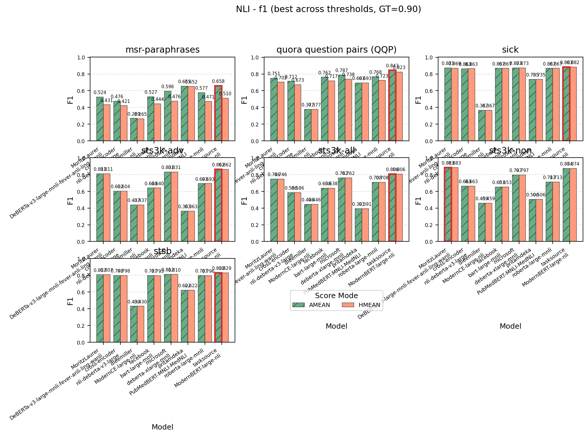
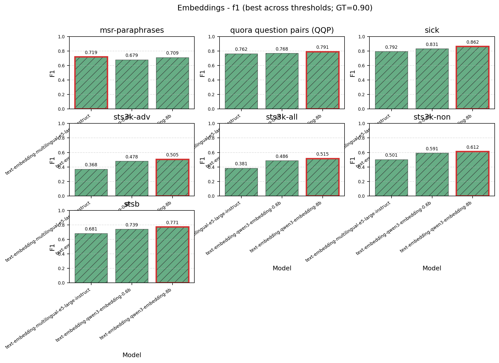
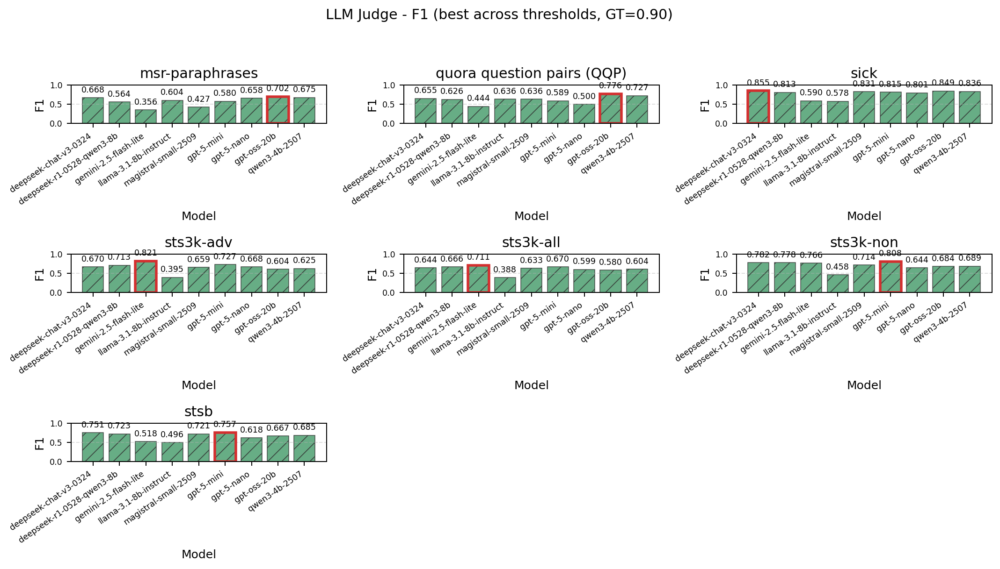
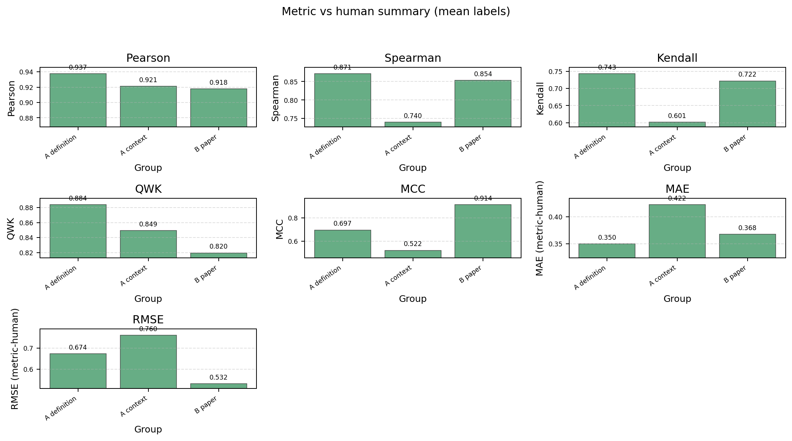
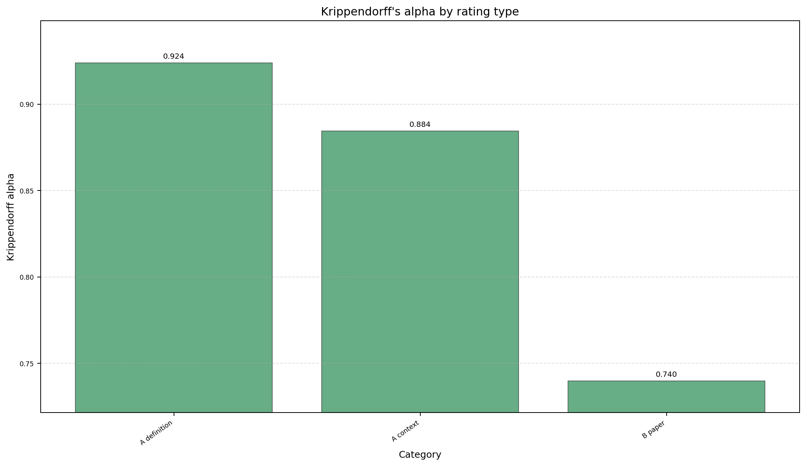
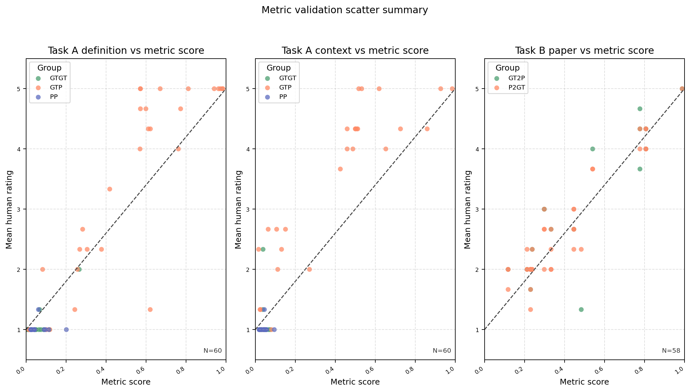
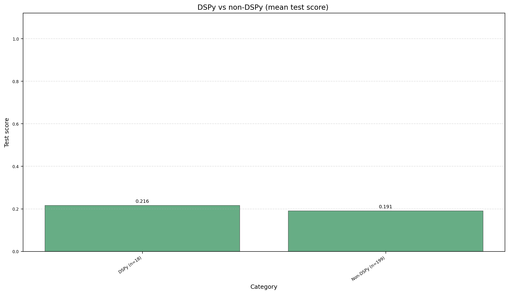
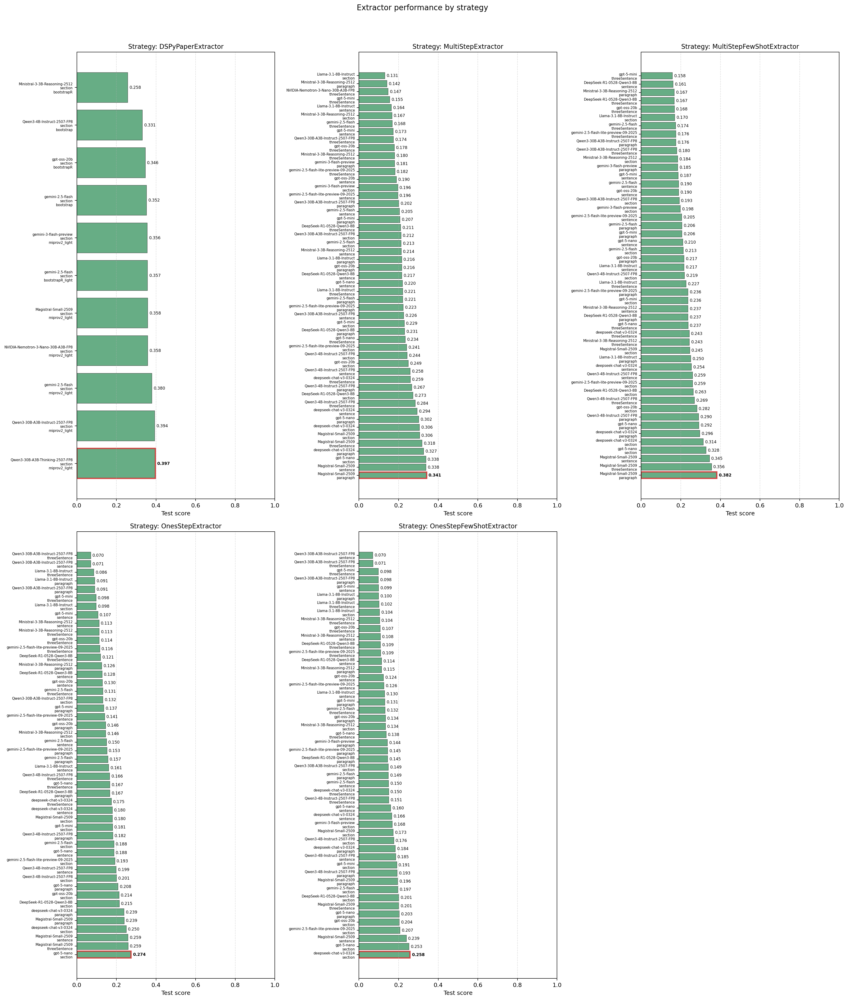
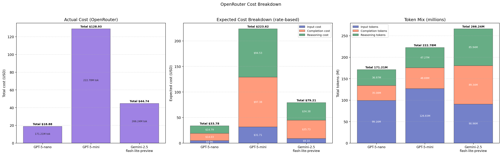

# Appendix (Supplementary Figures and Tables)

This appendix collects figures and tables that did not make it into the paper due to page limit.

## Figures

**Figure A1. NLI F1 across benchmark datasets (GT threshold 0.90).**

**Figure A2. Embedding cosine F1 across benchmark datasets (GT threshold 0.90).**

**Figure A3. LLM-as-a-judge F1 across benchmark datasets (GT threshold 0.90).**

**Figure A4. Metric vs human judgment correlations for DefSim.**

**Figure A5. Krippendorff's alpha for DefSim annotations.**

**Figure A6. Metric validation scatter plots (DefSim).**

**Figure A7. DSPy vs non-DSPy extractors (average performance, no-context).**

**Figure A8. Extractor performance by strategy (all configurations, no-context).**

**Figure A9. Cost breakdown for OpenRouter runs.**

## Tables

**Table A1. Best F1 per dataset across similarity metrics.**

| Dataset | NLI | Embeddings | LLM-judge |
|---|---|---|---|
| STS-B | 0.830 | 0.771 | 0.723 |
| STS3k-all | 0.806 | 0.515 | 0.666 |
| STS3k-adv | 0.862 | 0.505 | 0.713 |
| STS3k-non | 0.883 | 0.612 | 0.778 |
| SICK | 0.883 | 0.862 | 0.813 |
| MSRP | 0.658 | 0.719 | 0.564 |
| QQP | 0.843 | 0.791 | 0.553 |

**Table A2. Metric vs human agreement (mean label).**

| Task | Rating | Pearson | Spearman | Kendall | MCC |
|---|---|---|---|---|---|
| A | definition | 0.937 | 0.871 | 0.743 | 0.697 |
| A | context | 0.921 | 0.740 | 0.601 | 0.522 |
| B | definition | 0.953 | 0.938 | 0.845 | 0.871 |
| B | context | 0.912 | 0.932 | 0.817 | 0.719 |
| B | paper | 0.918 | 0.854 | 0.722 | 0.914 |

**Table A3. Krippendorff's alpha across annotators.**

| Task | Rating | N | Krippendorff alpha |
|---|---|---|---|
| A | definition | 60 | 0.924 |
| A | context | 60 | 0.884 |
| B | definition | 58 | 0.937 |
| B | context | 58 | 0.893 |
| B | paper | 58 | 0.740 |

**Table A4. Best configuration observed per strategy family (no-context).**

| Strategy | Best configuration (model, chunking) | Score |
|---|---|---|
| DSPyPaperExtractor | Qwen3-30B-A3B-Thinking-2507-FP8, section | 0.397 |
| MultiStepFewShotExtractor | Magistral-Small-2509, paragraph | 0.382 |
| MultiStepExtractor | Magistral-Small-2509, paragraph | 0.341 |
| OnesStepExtractor | gpt-5-nano, section | 0.274 |
| OnesStepFewShotExtractor | deepseek-chat-v3-0324, section | 0.258 |

**Table A5. Top-10 DSPy extractors (mini-GT).**

| Model | DSPyOptimizer | Chunking | TestScore |
|---|---|---|---|
| Qwen3-30B-A3B-Thinking-2507-FP8 | `miprov2_light` | section | 0.362 |
| gemini-2.5-flash | `miprov2_light` | section | 0.324 |
| gemini-3-flash-preview | `miprov2_light` | section | 0.320 |
| Qwen3-30B-A3B-Instruct-2507-FP8 | `miprov2_light` | section | 0.315 |
| NVIDIA-Nemotron-3-Nano-30B-A3B-FP8 | `miprov2_light` | section | 0.306 |
| gemini-2.5-flash | `bootstrapR_light` | section | 0.300 |
| gemini-2.5-flash | `bootstrap` | section | 0.299 |
| Magistral-Small-2509 | `miprov2_light` | section | 0.297 |
| gpt-oss-20b | `bootstrapR` | section | 0.297 |
| Qwen3-4B-Instruct-2507-FP8 | `bootstrap` | section | 0.268 |

**Table A6. Predicted definitions per paper vs ground truth (top-10).**

| Mean | Median | Min | Max | P10 | P25 |
|---|---|---|---|---|---|
| 16.55 | 10.00 | 0.00 | 98.00 | 2.00 | 5.00 |

**Table A7. Observed OpenRouter costs for non-DSPy extraction runs.**

| Model | Actual cost (USD) | Total tokens (M) |
|---|---|---|
| GPT-5-nano | 18.88 | 171.21 |
| GPT-5-mini | 128.93 | 222.78 |
| Gemini-2.5-flash-lite-preview | 44.74 | 266.24 |

## Asset index

- Figures: `appendix/figures/`
- Tables (source copies): `appendix/tables/`
