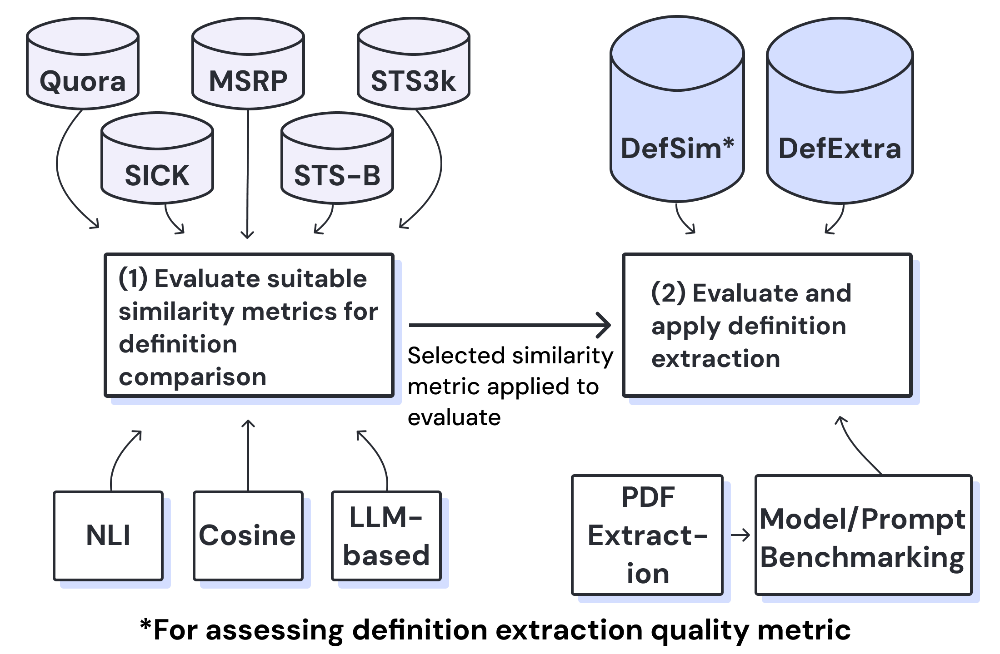

# SciDef: Automated Definition Extraction from Scientific Literature



## Overview

With the rapid growth of publications, identifying definitions relevant to a given keyword has become increasingly difficult.
**SciDef** provides resources to support research on **definition extraction and definition similarity** from scientific literature.

This repository contains:

- An LLM-based **definition extraction pipeline**
- **Scripts** for running and evaluating definition extraction
- **DefExtra**, a human-annotated dataset for definition extraction
- **DefSim**, a human-annotated dataset for definition similarity
- **Evaluation scripts** covering multiple models, prompting strategies, and similarity metrics

The goal of SciDef is to provide resources for reproducible research on on definition extraction from scientific articles.

## Datasets

To facilitate future research in Definition Extraction from Scientific articles we publish 2 human annotated datasets.

### DefExtra: Definition Extraction Dataset

[DefExtra](https://huggingface.co/datasets/mediabiasgroup/DefExtra) is a human-annotated dataset for the evaluation of definition extraction.

**Content**:

- 268 definitions from 75 papers
- 60 media bias related and 15 non-media bias related papers

**Important**:
- The public DefExtra release ships **markers only** (no excerpts). You must
  hydrate it from your own PDFs, then convert the hydrated CSV to SciDef's
  JSON ground-truth format. See `docs/defextra_integration.md`.

### DefSim: Definition Similarity Dataset

[DefSim](https://huggingface.co/datasets/mediabiasgroup/DefSim) is a human-annotated dataset for the evaluation of definition similarity.

**Content**:

- 60 definition definition pairs
- Similarity rating on a 1-5 scale

## Scripts and Usage

To support user-friendly usage, we provide scripts for running the SciDef pipeline, evaluation methods and other utility functions in the [scripts/](scripts) directory.

SciDef uses [uv](https://github.com/astral-sh/uv) for package and environment management.

## Documentation (AI-generated)

DISCLAIMER: The documentation in `docs/` was auto-generated with AI assistance.
Please verify commands and settings in your environment.

- [`docs/cli.md`](docs/cli.md): CLI reference and environment setup
- [`docs/defextra_integration.md`](docs/defextra_integration.md): DefExtra/DefSim integration
- [`docs/dspy_custom_extractor.md`](docs/dspy_custom_extractor.md): Custom DSPy extractor + training
- [`scripts/README.md`](scripts/README.md): script-by-script usage details

### Example

```bash
uv run python scripts/benchmark_nli.py --datasets stsb sick --sample-size 100
```

## Note on Contribution

We have recreated the repository for clean release and due to squashing of Git history, the commits do not reflect author's contribution.

## Citation

If you use this resource, please cite:

```bibtex
TODO
```
